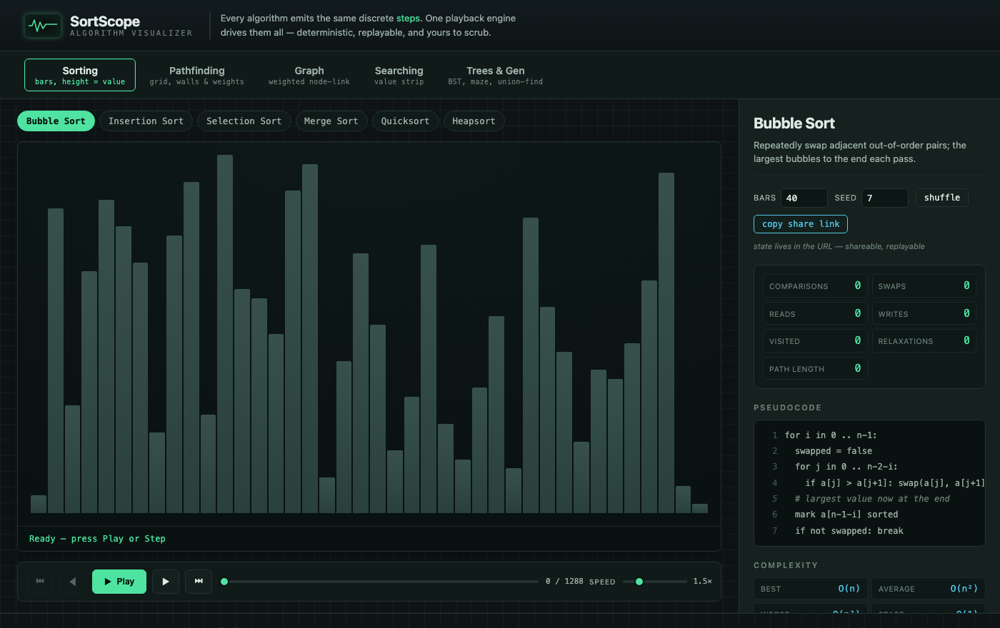

# SortScope

An interactive algorithm visualizer that plays sorting, pathfinding, graph and
search algorithms step by step — so you can *see* why one runs faster than another.



## Why it exists

Most algorithm animations are a black box: pretty motion, but no way to stop,
step back, or check the cost. SortScope treats every algorithm as a stream of
discrete **steps** — compare, swap, visit, relax, path — and feeds them all to
one playback engine. Because of that shared model, Play / Pause / Step / Reset /
scrub / speed behave identically for a bubble sort and for A\*, every run is
deterministic and replayable, and the counters (comparisons, swaps, reads,
writes, cells visited, path length) are the *real* numbers, not decoration.

24 algorithms in all:

| Category | Algorithms |
| --- | --- |
| Sorting (bars) | Bubble, Insertion, Selection, Merge, Quick, Heap |
| Pathfinding (interactive grid) | Dijkstra, A\* (Manhattan), BFS, DFS, Greedy Best-First, Bidirectional BFS |
| Graph (weighted node-link) | Prim MST, Kruskal MST, Kahn topological sort, Bellman-Ford (negative edges) |
| Search (value strip) | Linear, Binary |
| Trees & generation | BST insert, in-order, pre-order and post-order traversals (four separate picks), maze generation, union-find with path compression |

The pathfinding grid is fully interactive — draw walls, drag the start and end,
paint weighted cells, or stamp a generated maze. State (algorithm, seed, size,
walls, endpoints) lives in the URL, so any run is a shareable, exactly-replayable
link.

## Private by construction

SortScope runs **100% client-side**. There is no backend, no account, and no
analytics. A strict Content-Security-Policy sets `connect-src 'none'`, so the
page cannot make a network request even if it tried — nothing you do ever leaves
your device.

## Quickstart

```sh
npm install
npm run dev      # local dev server
npm run build    # static build to ./dist (served under /sortscope/)
npm run preview  # preview the production build
```

Built with [Astro](https://astro.build) as a static site under a `/sortscope`
base path; every asset is referenced through `import.meta.env.BASE_URL` so it
deploys cleanly to a project subpath.

## Disclaimer

SortScope is a free teaching aid, provided **as is** under the MIT License,
**without warranty of any kind**. It visualizes standard textbook algorithms for
learning; it is not intended for production use, benchmarking of real workloads,
or any decision that carries risk. Verify anything you rely on. In no event shall
the author be liable for any claim, damages, or other liability arising from use
of this software. See [LICENSE](./LICENSE) for the full terms.

## License

MIT © 2026 Sreenivas Sadhu Prabhakara
